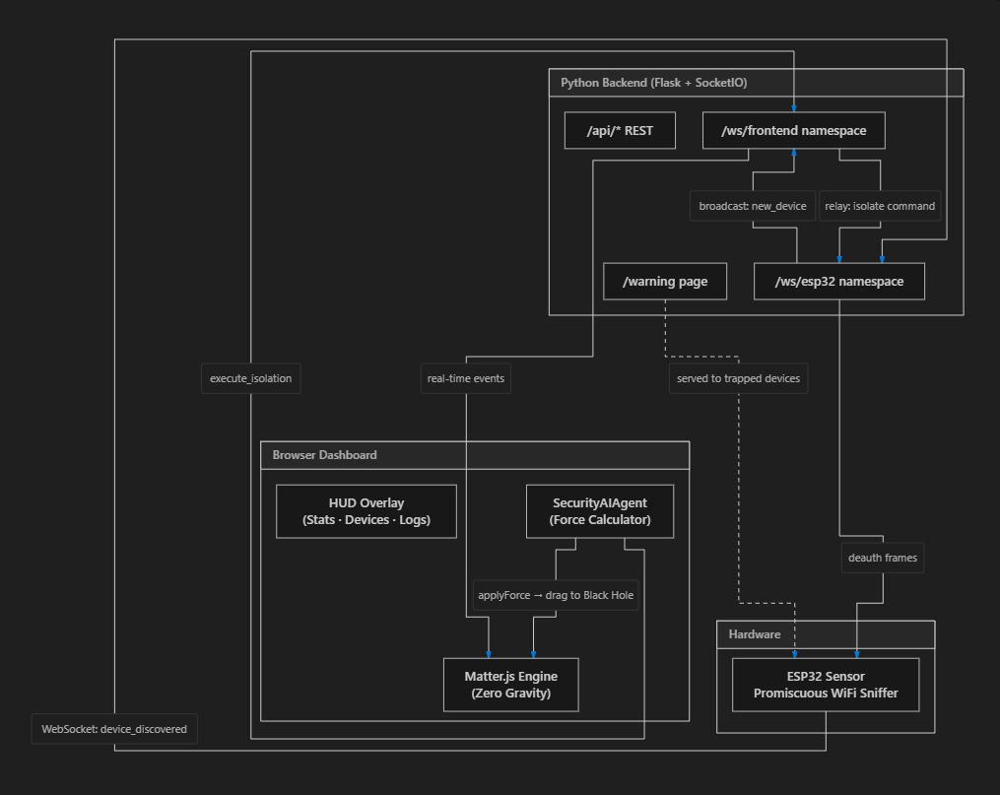

<div align="center">
  
  <h1>WireDown</h1>
  <p><strong>Autonomous AI-Driven Honeypot in a Zero-Gravity Physics UI</strong></p>
</div>

<br />

## 🚨 Overview: The Ultimate Wi-Fi Honeypot & Network Security Trap

**WireDown** is a next-generation "nuclear" honeypot system that turns network security into a living, zero-gravity physics simulation. Built for elite threat detection and network intrusion defense, it lures attackers in, watches them in real-time, calculates a composite cybersecurity threat score, and responds autonomously. It visually represents network threats being physically dragged into a "Black Hole." 

Every attacking device is isolated via hardware-level Wi-Fi deauthentication, progressive bandwidth throttling, and psychological deterrence payloads.

---

## 📑 Table of Contents
- [Overview](#-overview-the-ultimate-wi-fi-honeypot--network-security-trap)
- [System Architecture](#-system-architecture)
- [Nuclear Feature Suite](#-nuclear-feature-suite)
  - [Deep Packet Detection](#-1-deep-packet-detection)
  - [Deception Traps](#-2-deception-traps)
  - [Multi-Factor Threat Engine](#-3-multi-factor-threat-engine)
  - [Autonomous Responses](#-4-autonomous-responses)
- [AI Agent Lifecycle](#-ai-agent-lifecycle)
- [Deployment (Proxmox & Docker)](#-proxmox--docker-deployment-recommended)
- [Disclaimer](#-disclaimer)

---

## 🏗️ System Architecture

WireDown operates across four distinct layers to ensure total network domination over intruders:



1. **Hardware Layer (ESP32)**: Sniffs raw 802.11 frames in promiscuous mode to intercept ARP Spoofing, Deauth Floods, MAC Floods, and KRACK attacks at the physical layer.
2. **Backend Hub (Python/Flask)**: Central intelligence hub that acts as a DNS Sinkhole, Port Scan Detector, and Fake SSH/Admin trap.
3. **AI Agent & Physics Engine (Matter.js)**: Network devices physically manifest as bodies in a zero-gravity environment. The AI calculates inverse-square attraction forces to neutralize threats.
4. **Threat Intelligence Engine**: Replaces traditional binary flagging with a multi-factor scoring algorithm.

---

## ⚡ Nuclear Feature Suite

### 🔴 1. Deep Packet Detection
* **ARP Spoofing Detection:** Catches Man-in-the-Middle attempts by tracking MAC-to-IP discrepancies.
* **KRACK Attack Detection:** Monitors EAPOL handshakes for Message 3 retransmissions.
* **Flood Detectors:** Flags Deauth/Disassoc storms and MAC flooding (CAM table overflows).
* **Port Scan & Brute Force:** Identifies aggressive probing across 11 common ports.

### 🟣 2. Deception Traps
* **CVE-2024-3094 (XZ Backdoor) Bait:** A highly convincing fake SSH server advertising an exploitable version of `liblzma/xz`. It monitors RSA certificates for abnormal entropy to catch sophisticated supply-chain exploits.
* **Fake Router Admin Panel:** A fully styled `NetGate Pro R4500` login portal that logs credentials from snooping attackers.

### 🟢 3. Multi-Factor Threat Engine
Scores combine dynamically. When an attacker hits `Score >= 60`, the AI Agent engages:
* **+80** XZ Backdoor Exploit Attempt ☠️
* **+60** KRACK Attack 🔓
* **+50** Deauth Flood ⚡
* **+40** ARP Spoofing 🕸
* **+30** SSH Login Attempt 💻

### 🔵 4. Autonomous Responses
* **Black Hole Gravity Trap:** AI calculates vector forces to drag the attacker's UI orb into the network trap.
* **Layer-2 Deauth Isolation:** ESP32 hardware forces the attacker off the network.
* **Progressive Bandwidth Throttle:** From 100% → 50% → 10% → 1% → Total Blackout.
* **Psychological Deterrence:** A captive portal displaying a 60-second self-destruct timer and fake forensic extraction to scare off script kiddies.

---

## 🧠 AI Agent Lifecycle

The autonomous AI monitors the zero-gravity environment. Devices undergo a rigorous lifecycle based on their Threat Score:


1. **Safe (Green):** Gentle drift in the zero-gravity vacuum.
2. **Suspicious (Amber):** Threat score `30-59`. Visual warning rings appear.
3. **Stalking:** Threat score `≥ 60`. The AI pauses for dramatic tension before striking.
4. **Engaging (Red):** The AI calculates an inverse-square force vector and drags the attacker.
5. **Destroyed:** Upon colliding with the Black Hole, the device is visually crushed, and isolation commands are fired.

---

## 🚀 Proxmox & Docker Deployment (Recommended)

WireDown can be fully deployed in seconds using our advanced Proxmox helper scripts. Choose either an LXC Container (recommended for low overhead) or a fully isolated Virtual Machine.

Run one of the commands below directly in your Proxmox Node shell:

**Option 1: LXC Container (Lightweight Debian 12)**
```bash
bash -c "$(wget -qO - https://raw.githubusercontent.com/boubli/WireDown/master/proxmox-lxc.sh)"
```

**Option 2: Virtual Machine (Isolated Ubuntu 22.04 Cloud-Init)**
```bash
bash -c "$(wget -qO - https://raw.githubusercontent.com/boubli/WireDown/master/proxmox-vm.sh)"
```

During installation, the script will prompt you to customize resources (CPU Cores, RAM, Disk Size, and Network Bridge). Once deployed, it will automatically output the exact URLs for your Zero-Gravity Dashboard.

### 🔄 Updating Existing Deployments

To instantly pull the latest GitHub code to all your running WireDown LXC containers, run the automated Proxmox Update Utility:
```bash
bash -c "$(wget -qO - https://raw.githubusercontent.com/boubli/WireDown/master/proxmox-update.sh)"
```

---

## 🛠️ Manual Deployment (Docker Compose)

If you prefer to run it manually via Docker Compose on any system:

```bash
git clone https://github.com/boubli/WireDown.git
cd WireDown
docker compose up -d
```
Access the dashboard at `http://<YOUR_IP>:8080`.

### Flash the ESP32 (Optional Hardware Layer)
Update `esp32_sensor/esp32_sensor.ino` with your WiFi credentials and backend IP, then flash it to an ESP32 board to enable real-world promiscuous sniffing and layer-2 deauth attacks.

---

## ⚠️ Disclaimer

**WireDown is built for educational and defensive purposes only.**
The active response modules (Deauth, DNS Sinkholing, etc.) should only be executed on networks you own and have explicit permission to monitor. Misuse of these tools on public or unauthorized networks is illegal. The authors are not responsible for any damage caused by this software.
